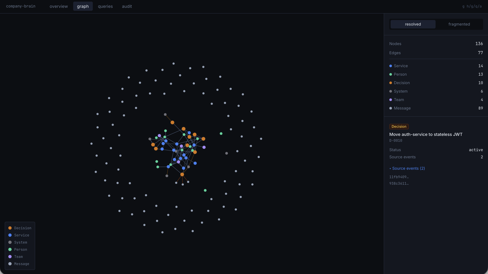
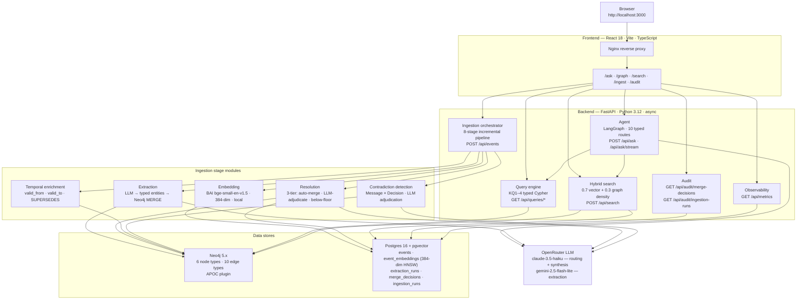
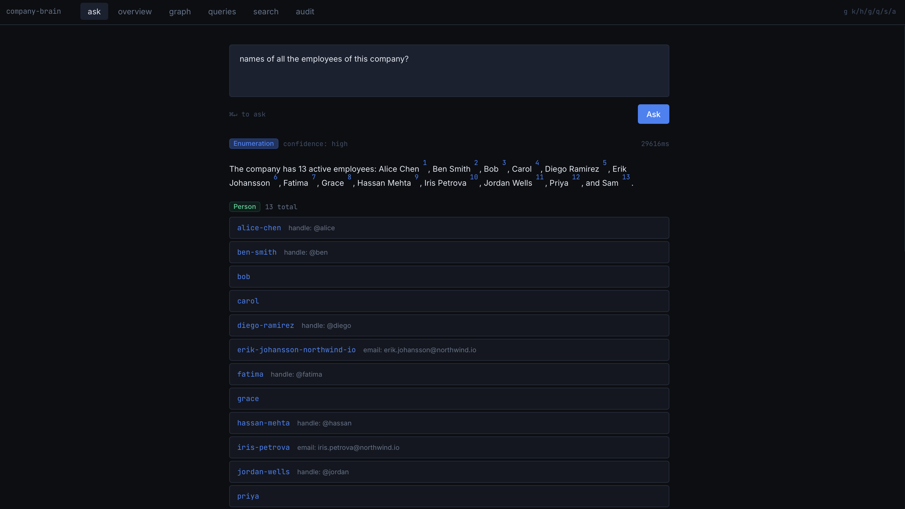
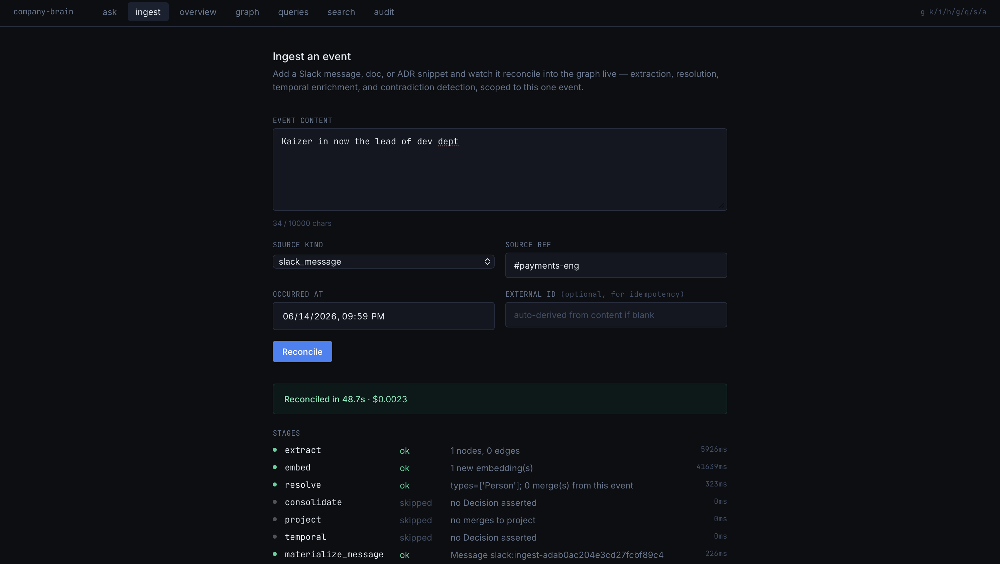
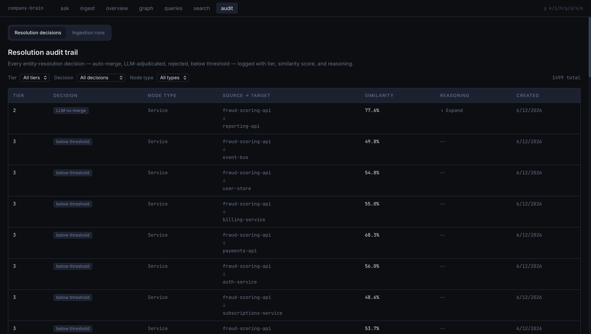
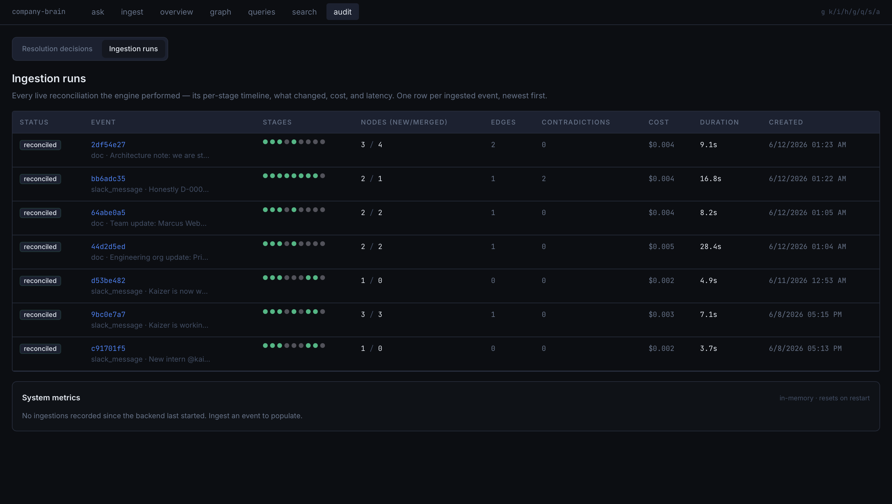

# Company Brain

A self-updating knowledge graph that ingests company intelligence — Slack messages, architecture decisions, meeting notes — and answers multi-hop questions with grounded, citation-verified answers. Built as a portfolio project to demonstrate where graph databases outperform pure RAG.

---

## Demo

> **Recording in progress** — the 3-minute walkthrough script is at
> [docs/demo/3-minute-walkthrough.md](docs/demo/3-minute-walkthrough.md).
> The recorded Loom will be linked here once captured.

<!-- When recorded:
[](LOOM_URL)
-->


---

## What it does

Company Brain extracts entities and relationships from raw company documents — architecture decision records, Slack-style messages, meeting notes — and stores them in a Neo4j knowledge graph. Every node traces back to the raw event that asserted it. Every edge carries a confidence score and a provenance pointer. When a new event arrives, the pipeline reconciles it into the existing graph in real time: a new person appears, a contradiction lights up, an answer changes — in about six seconds, live, on screen.

The system exposes a LangGraph agent that turns plain-English questions into grounded answers. The agent routes each question to one of ten typed tools — four multi-hop Cypher traversals, four structural graph tools, hybrid vector+graph retrieval, and a refusal path — then verifies every citation before returning. Nothing reaches the user unflagged if a citation can't be grounded in the graph.

The reason it's a graph and not a document index is four queries that pure RAG cannot answer. RAG retrieves semantically similar chunks; it cannot follow typed edges, compare set membership across corpora, or reconstruct a change timeline with approvers. Those four queries are the system's reason for existing and the demo's centrepiece.

**The four killer queries:**

- **Multi-hop ownership** — *Who owns the service that depends on the system deprecated by Decision X?* Requires a 4-hop traversal: Decision → deprecated System → dependent Service → owning Team → lead Person. RAG retrieves semantically similar chunks; it cannot follow typed edges.
- **Temporal contradiction** — *Which currently-active decisions are contradicted by discussions in the last month?* Requires time-filtered set comparison across two corpora. RAG retrieves nearest neighbours, not logical contradictions.
- **Blast radius** — *If the payments service fails, which services, decisions, and people are affected?* Requires multi-type graph reachability across Service → Service → Decision → Person.
- **Provenance + change tracking** — *What has changed about the auth system this quarter, and who approved each change?* Requires temporal edge traversal and approval attribution.

---

## Architecture



The system has two databases because graph traversal and vector similarity are different storage problems. Neo4j handles the typed, multi-hop traversals the killer queries need — Cypher `MATCH (d:Decision)-[:DEPRECATES]->(s:System)<-[:DEPENDS_ON]-(svc:Service)` is not expressible in SQL. Postgres + pgvector handles embeddings, the raw event log, and the audit trail. Both stores carry provenance: graph nodes hold `source_event_ids` (UUIDs in the `events` table), graph edges hold `confidence` and `extracted_by`, and the `merge_decisions` table records every entity resolution attempt with the LLM's reasoning.

The LLM choices are deliberate. `claude-3.5-haiku` handles routing and synthesis — two calls in the agent's critical path where quality and reasoning matter. `gemini-2.5-flash-lite` handles extraction at ingestion time, where cost and JSON-mode reliability matter more than prose quality. Both are accessed via OpenRouter so the model can be swapped by config without touching the pipeline code.

---

## How it works

```mermaid
graph LR
    RAW["Raw event\ndoc · slack · meeting"]

    subgraph stage1 ["Stage 1 — Extract"]
        E1["LLM prompt → JSON\nentities + relationships\nevidence_quote required"]
        E2["Pydantic validation\nNeo4j MERGE with provenance\nextraction_runs audit row"]
    end

    subgraph stage2 ["Stage 2 — Embed"]
        EM["bge-small-en-v1.5 local inference\n384-dim vector → Postgres\nHNSW index on event_embeddings"]
    end

    subgraph stage3 ["Stage 3 — Resolve"]
        R1["Tier 1: auto-merge\n(shared email/handle, known alias)"]
        R2["Tier 2: LLM adjudicate\n(cosine ≥ 0.75 band)"]
        R3["Tier 3: below-floor\n(leave as separate nodes)"]
        R4["merge_decisions audit row\nper attempt · tier · LLM reasoning"]
    end

    subgraph stage45 ["Stages 4–5 — Consolidate + Project"]
        C["Consolidate: Decision multi-source dedup\nloser.status = merged\nloser→winner MERGE_INTO edge"]
        P["Project: copy loser edges onto winner\npreserves graph reachability\nwithout migrating data"]
    end

    subgraph stage67 ["Stages 6–7 — Temporal + Contradict"]
        T["Enrich valid_from · valid_to · status\nSUPERSEDES edge on supersession\nMaterialize Message nodes (slack)"]
        CT["Contradiction scan\nnew Message × active Decisions\nLLM adjudication → CONTRADICTS edge"]
    end

    subgraph stage8 ["Stage 8 — Index"]
        IDX["No-op: embedding written in Stage 2\nalready queryable for hybrid search"]
    end

    DONE["Reconciled\nNeo4j graph updated\ningestion_runs row written"]

    RAW --> stage1 --> stage2 --> stage3 --> stage45 --> stage67 --> stage8 --> DONE
```



A new event enters as a raw string and exits as reconciled graph state in eight stages. The pipeline is idempotent at every stage: Neo4j `MERGE` ensures re-running an extraction never duplicates nodes; the extraction skip-guard checks the `extraction_runs` audit table before calling the LLM; embedding is a no-op if the vector already exists. This means the demo's "submit twice, same result" behaviour — a live double-submit returns `deduplicated: true` in 0 ms — is not a special case; it falls out of the architecture.

The idempotency contract has a scoping twist. Entity resolution and contradiction detection are expensive (each makes 0–N LLM calls). Rather than re-running them on the entire graph on every ingest — the first naïve implementation spent 52 seconds re-adjudicating 61 pre-existing pairs that had nothing to do with the new event — the resolution stage scopes to *newly-created fragments* only: nodes whose sole provenance is this event. Cheap, deterministic stages (embed, consolidate, project, temporal) run on the full graph because at demo scale they take milliseconds and a re-run is a no-op.

The audit trail is structural: `merge_decisions` records every resolution attempt (auto-merge, LLM-merge, LLM-no-merge, below-threshold) with tier, embedding similarity, and LLM reasoning. `ingestion_runs` records every reconciliation with per-stage timing and status. Nothing is a black box; every AI decision has a receipt.

---

## Capabilities

**Agent routing — 10 typed routes, 100% accuracy on 42-question eval**

The agent classifies each question in a single LLM call (one enum-constrained prompt, no ambiguity), then routes to one of ten typed tools. The final eval ([Phase 4C](docs/eval/phase-4c-structural-results.md)) ran 42 questions across all ten routes — KQ1–4 (5 each), search (5), unknown/refusal (5), and the four structural tools (3 each). Route accuracy: 1.000. Refusal correctness: 1.000. Mean cost: $0.005/question. Mean latency: 7.5s (two sequential LLM calls; first-token streaming starts at ~2.5s). The 4s latency target was missed; the cause and the production mitigation are documented in the eval.

**Typed tools, not generated Cypher** ([ADR 0023](docs/decisions/0023-typed-tools-not-generated-cypher.md))

The agent never generates Cypher at runtime. It calls five functions: the four KQ query functions and `hybrid_search`. The structural tools (enumerate, aggregate, get_entity, neighbors) are also typed Python functions over the graph. No injection surface, no parse errors, enumerable and testable behaviour. The tradeoff — reduced flexibility versus a hand-rolled Cypher generator — is documented.

**Provenance verification loop** ([ADR 0025](docs/decisions/0025-provenance-verification-loop.md))

Every `[evt:UUID]` in the synthesised answer is checked against the tool's provenance set before the response is returned. A fabricated citation triggers a strict-prompt retry (max 2), then a flagged best-effort. No unflagged fabrication reaches the user. First-try verification rate: 0.812 (Phase 4C eval). Structural tool answers — counts, lists, aggregates — skip citation verification because there is no single event behind a count; the agent honestly shows those grounded in graph structure, not fabricated sources.

**8-stage incremental reconciliation** ([design/incremental-reconciliation.md](docs/design/incremental-reconciliation.md))

The ingestion pipeline processes a new event end-to-end in ~6s mean (Phase 5A: 5.8s mean across 11 cases, $0.003/event). The distribution is wide (1.4s–15s) because the floor is the LLM extraction call and the ceiling was the embedding model cold-start on the first eval case. Per-case: the idempotency case (replay of an existing event) costs 0 ms after the skip-guard fires. 11-case eval: 100% success, 100% pass.

**Hybrid retrieval** ([design/semantic-search.md](docs/design/semantic-search.md))

Search blends 0.7 weight on `bge-small-en-v1.5` vector similarity with 0.3 weight on how many graph entities an event asserted. The graph-density component ranks events that grounded more graph structure higher, lifting structurally-important events above semantically-similar but structurally-thin ones. Eval ([Phase 3D](docs/eval/phase-3d-search-results.md)): Recall@10 = 0.942, MRR = 0.910. Warm latency ~150ms (first-query cold-start pays the embedding model load).

**3-tier entity resolution** ([design/entity-resolution.md](docs/design/entity-resolution.md))

Resolves `@alice`, `Alice Chen`, and `alice.chen@northwind.io` to one canonical Person node. Tier 1 auto-merges on deterministic rules (shared email/handle, curated alias pairs). Tier 2 sends the close-but-no-rule band (cosine ≥ 0.75) to `claude-3.5-haiku`. Tier 3 leaves the rest alone. Merges are non-destructive: a `MERGE_INTO` edge connects loser to winner; the fragmented view shows the work; the resolved view is what the queries see. Every attempt (merge and no-merge alike) is recorded in `merge_decisions`.

**Measure-then-optimise: the 5B headline** ([eval/phase-5b-observability-results.md](docs/eval/phase-5b-observability-results.md))

Phase 5B built in-memory metrics first, then used them to validate the planned optimisation. The finding: the 15s tail in the Phase 5A ingestion eval was the embedding model's cold-start on the first eval case — not sequential Tier-2 LLM adjudication as assumed. `doc-new-person` makes **zero** Tier-2 calls (all 16 resolution candidates fall below the 0.75 floor). The parallelisation shipped anyway — it delivers a clean 4.0× speedup (45.7s → 11.3s) when fan-out is genuinely high (forced experiment: 16 adjudications under `Semaphore(5)`). That case is rare on this corpus; the parallelisation is an insurance policy, not a headline win. Documented, not hidden.

---

## Screenshots

**Graph — resolved knowledge graph, 136 nodes, nodes coloured by type**


*The `/graph` page after entity resolution. Decisions in amber, services in blue, people in green, systems in gray, teams in lavender. Switching to the fragmented view shows the MERGE_INTO edges — one dashed line per resolution decision. Every node has a source-event drilldown.*

---

**Ask — agent answering a multi-hop query with streaming citations**



*The `/ask` page after "Who owns the service that depends on the system deprecated by D-0006?" The agent routed to KQ1, ran the 4-hop traversal, and streamed the answer token-by-token. Superscript citations are clickable — each opens the raw source event. "Show agent trace" reveals the route classification, reasoning, and per-stage timings.*

---

**Ingest — live reconciliation with per-stage timeline**



*The `/ingest` page after pasting a new Slack message and hitting Reconcile. The per-stage timeline fills in real time: `extract ✓`, `embed ✓`, `resolve ✓` (new person, no match), contradiction stages `skipped`. The "what changed" panel names the new node created. ~6s end-to-end.*

---

**Audit — ingestion runs tab with stage-dot timelines and system metrics**





*The `/audit` page on the Ingestion runs tab. Each row is one live reconciliation: status, event snippet, per-stage dot timeline (green = ok, gray = skipped, red = failed), nodes created/merged, contradiction count, cost, and duration. The System metrics strip below reads from `/api/metrics` — total ingestions, median and p95 latency, mean cost, resolution adjudication breakdown.*

---

## How to run

Requires: Docker (Compose v2), an [OpenRouter](https://openrouter.ai) API key.

```bash
git clone <repo-url>
cd company-brain

# 1. Environment
cp .env.example .env
# Edit .env — set OPENROUTER_API_KEY=sk-or-...

# 2. Start the stack
docker compose up --build
# Neo4j, Postgres, backend (FastAPI), frontend (Nginx + React) all start together.

# 3. Verify health
curl localhost:8000/health
# → {"status":"ok","neo4j":"connected","postgres":"connected"}

# 4. Seed the synthetic corpus (deterministic; safe to re-run)
docker compose exec backend python -m app.synthetic.seeder
# Writes 89 raw events into Postgres. Graph stays empty until extraction.

# 5. Extract the graph  (~$0.42 for the full corpus; uses OPENROUTER_API_KEY)
docker compose exec backend python -m app.synthetic.extract_all
# Runs extraction → embed → resolve → consolidate → project → temporal → contradict
# for every event. Takes 5–10 minutes. Idempotent: safe to re-run.

# 6. Open the app
open http://localhost:3000
```

**First things to try:**

- `/graph` — the resolved graph. Toggle "fragmented" to see the MERGE_INTO edges.
- `/ask` → type "Who owns the service that depends on the system deprecated by D-0006?" — the 4-hop traversal.
- `/ask` → type "List all employees" — structural enumeration; returns all 13.
- `/ingest` → paste `Slack #general: welcome aboard Nadia Okafor, joining the platform team.` → Reconcile. Then re-ask "List all employees" — count goes 13 → 14.
- `/audit?tab=ingestion-runs` — the reconciliation receipt for the ingest you just triggered.

**Restoring the pristine demo baseline** (Person=13, Service=12, System=5):

```bash
docker compose exec backend python -m app.synthetic.seeder
docker compose exec backend python -m app.synthetic.extract_all
```

**Running tests and type-checking:**

```bash
# Install uv: https://docs.astral.sh/uv/getting-started/installation/
uv sync --extra dev          # creates .venv; installs all deps including dev extras

uv run pytest                # 442 backend tests (hermetic; no live DB required for most)
uv run mypy backend/         # strict mode; must pass clean
cd frontend && npm install && npm test  # frontend tests (Vitest + React Testing Library)
```

> **Note on integration tests:** tests that spin up live containers (`testcontainers`) require a Docker socket, which some environments block. The live eval harness runs those cases via `docker compose exec backend` instead.

---

## Engineering artifacts

The design docs, ADRs, and eval results are the first-class artifacts of this project. Every architectural claim in this README links to the document that defends it. The ADRs in particular are worth reading for the explicit tradeoff reasoning — the goal was to write ADRs that explain *why*, not just *what*.

### Phase 1 — Foundation + Schema

| Artifact | What it is |
|----------|-----------|
| [design/graph-schema.md](docs/design/graph-schema.md) | 6 node types, 10 edge types, designed backward from the 4 killer queries |
| [design/postgres-schema.md](docs/design/postgres-schema.md) | Immutable event log + pgvector embeddings + audit tables |
| [ADR 0002](docs/decisions/0002-neo4j-as-graph-database.md) | Why Neo4j over a relational graph or property graph extension |
| [ADR 0003](docs/decisions/0003-pgvector-vs-dedicated-vector-db.md) | Why pgvector co-located with the event log, not a dedicated vector DB |
| [ADR 0007](docs/decisions/0007-graph-schema-v1.md) | Schema design rationale and closed-entity-type decision |
| [ADR 0009](docs/decisions/0009-postgres-event-store-design.md) | Event store design: append-only, UUID-keyed, cross-store provenance |
| [ADR 0011](docs/decisions/0011-synthetic-data-strategy.md) | Why synthetic data; adversarial test cases; single-source-of-truth eval |

### Phase 2 — Extraction

| Artifact | What it is |
|----------|-----------|
| [design/extraction-pipeline.md](docs/design/extraction-pipeline.md) | LLM extraction pipeline: prompt design, provenance contract, eval harness |
| [eval/phase-2b-results.md](docs/eval/phase-2b-results.md) | 3-model comparison (gpt-4o-mini / haiku / gemini-2.5-flash-lite): P/R/F1 per entity type |
| [ADR 0012](docs/decisions/0012-extraction-via-openrouter.md) | OpenRouter + JSON-mode: why not function calling, why curated schema |
| [ADR 0013](docs/decisions/0013-eval-ground-truth-from-narrative.md) | Ground truth derived from `narrative.py` — no hand-labelled file |

### Phase 3 — Resolution, Queries, Search

| Artifact | What it is |
|----------|-----------|
| [design/entity-resolution.md](docs/design/entity-resolution.md) | 3-tier resolution model: auto-merge, LLM-adjudicate, below-floor |
| [design/query-engine.md](docs/design/query-engine.md) | Typed Cypher for KQ1–4: traversal patterns, `as_of` convention, provenance shape |
| [design/semantic-search.md](docs/design/semantic-search.md) | Hybrid retrieval: 0.7/0.3 vector+graph blend, HNSW index, eval methodology |
| [eval/phase-3a-resolution-results.md](docs/eval/phase-3a-resolution-results.md) | Entity resolution eval: precision/recall on ALIAS_GROUPS + LOOK_ALIKE_PAIRS |
| [eval/phase-3b-query-results.md](docs/eval/phase-3b-query-results.md) | KQ1–4 integration eval against `narrative.py` expected answers |
| [eval/phase-3d-search-results.md](docs/eval/phase-3d-search-results.md) | Hybrid search eval: Recall@10 = 0.942, MRR = 0.910 (20 questions) |
| [ADR 0014](docs/decisions/0014-entity-resolution-tiered-confidence.md) | Tiered confidence model: why 3 tiers, why the 0.75 floor |
| [ADR 0015](docs/decisions/0015-merge-decisions-audit-table.md) | `merge_decisions` audit table: non-destructive merges, Postgres as the record |
| [ADR 0016](docs/decisions/0016-temporal-query-model.md) | `as_of` convention, `valid_from/to`, `SUPERSEDES` edge |
| [ADR 0022](docs/decisions/0022-hybrid-search-blend-weights.md) | 0.7/0.3 blend rationale and sensitivity analysis |

### Phase 4 — Agent

| Artifact | What it is |
|----------|-----------|
| [design/agent-architecture.md](docs/design/agent-architecture.md) | LangGraph state machine: classify → execute → synthesise → verify → retry |
| [design/agent-streaming.md](docs/design/agent-streaming.md) | SSE streaming design: why stream synthesis only, not the full agent trace |
| [design/structural-tools.md](docs/design/structural-tools.md) | Enumerate, aggregate, get_entity, neighbors: scope, eval methodology |
| [eval/phase-4a-agent-results.md](docs/eval/phase-4a-agent-results.md) | Agent eval (30 questions): route accuracy, citation overlap, verification rate |
| [eval/phase-4b-streaming-results.md](docs/eval/phase-4b-streaming-results.md) | Streaming eval: first-token latency, token rate, SSE reliability |
| [eval/phase-4c-structural-results.md](docs/eval/phase-4c-structural-results.md) | **Final agent eval (42 questions, all 10 routes)**: 1.000 route accuracy |
| [ADR 0023](docs/decisions/0023-typed-tools-not-generated-cypher.md) | Why typed tools instead of LLM-generated Cypher |
| [ADR 0024](docs/decisions/0024-route-then-execute-architecture.md) | Route-then-execute state machine: one classifier call, not ReAct |
| [ADR 0025](docs/decisions/0025-provenance-verification-loop.md) | Provenance verification: why retry on hallucinated citation, not soft failure |
| [ADR 0026](docs/decisions/0026-sse-not-websockets.md) | SSE over WebSockets for streaming: why unidirectional is enough |
| [ADR 0028](docs/decisions/0028-structural-tools-scope.md) | Structural tool scope: what enumerate/aggregate/neighbors cover and don't |
| [ADR 0030](docs/decisions/0030-verification-skip-for-structural.md) | Why structural tool answers skip citation verification |

### Phase 5 — Ingestion + Observability

| Artifact | What it is |
|----------|-----------|
| [design/incremental-reconciliation.md](docs/design/incremental-reconciliation.md) | 8-stage per-event pipeline: idempotency contract, hybrid scoping decision |
| [design/observability.md](docs/design/observability.md) | In-memory metrics registry: counters, histograms, `/api/metrics` shape |
| [eval/phase-5a-ingestion-results.md](docs/eval/phase-5a-ingestion-results.md) | Live ingestion eval (11 cases): 100% pass, ~6s mean, $0.003/event |
| [eval/phase-5b-observability-results.md](docs/eval/phase-5b-observability-results.md) | **The headline finding**: 15s tail was cold-start not adjudication; 4.0× speedup under fan-out |
| [ADR 0031](docs/decisions/0031-incremental-reconciliation.md) | Hybrid scoping: scope resolution + contradiction, reuse cheap stages globally |
| [ADR 0032](docs/decisions/0032-idempotency-contract.md) | Idempotency contract: MERGE everywhere, skip-guard, dedup detection |
| [ADR 0033](docs/decisions/0033-single-writer-lock.md) | Single-writer advisory lock: why not optimistic concurrency at demo scale |
| [ADR 0034](docs/decisions/0034-in-memory-metrics-for-demo-scale.md) | In-memory metrics: volatile by design, named honestly, production path documented |
| [ADR 0035](docs/decisions/0035-parallel-resolution-adjudication.md) | Parallel Tier-2 adjudication under `Semaphore(5)`: measured 4.0× speedup |

---

## What this is not

This is a **synthetic-data portfolio project**. The following limitations are deliberate scope decisions — the architecture notes what would change to address each one.

**Synthetic data only.** All entities (13 people, 5 teams, 12 services, 5 systems, 10 decisions) are generated from a deterministic seeder (`backend/app/synthetic/`). No real company data is ever ingested. The adversarial test cases (name aliases, 4-hop deprecation chains, active-decision contradictions) are hand-designed, not organic. A production version would need a connector layer for real Slack, Confluence, and GitHub data — and a different trust model for LLM-extracted claims about real people.

**Single-writer concurrency.** The ingestion pipeline holds a Postgres advisory lock for the duration of a reconciliation ([ADR 0033](docs/decisions/0033-single-writer-lock.md)). Concurrent ingest requests queue behind the lock. At demo scale (one user, tens of ingestions) this is invisible. At production scale, per-canonical-node locks or an async worker queue would replace it. The ADR documents the path.

**In-memory metrics only.** The `GET /api/metrics` endpoint reads from an in-memory registry that resets on process restart ([ADR 0034](docs/decisions/0034-in-memory-metrics-for-demo-scale.md)). The durable per-run record is the `ingestion_runs` table. A production version would emit OpenTelemetry spans and expose Prometheus metrics.

**No authentication or multi-tenancy.** There is no JWT, OAuth, or row-level access control. The API is open on the Docker network. There is no concept of "your organisation's graph" vs "their graph". The design docs note what would be needed; adding auth was out of scope for a solo demo project.

**Closed entity types.** The graph schema is fixed at 6 node types and 10 edge types, chosen to answer the 4 killer queries ([ADR 0007](docs/decisions/0007-graph-schema-v1.md)). The extraction pipeline uses a curated JSON schema; it does not discover new entity types at runtime. A production version with open-ended schemas would need a type discovery layer and a more flexible graph model.

**Deferred source types.** The current pipeline handles two source types: `doc` (architecture decisions, meeting notes) and `slack` (messages). ADR, meeting-note, and Jira-ticket parsers are noted as deferred in ADR 0031. The connector model for them is documented but not implemented.

**No path-finding tool.** The agent's structural tools cover enumeration, aggregation, typed-neighbour lookup, and entity fetch. A path-finding tool (shortest path between two entities) was identified as the most valuable next addition ([ADR 0028](docs/decisions/0028-structural-tools-scope.md)) and is the natural 6B addition.

---

## Tech stack

| Layer | Technology |
|-------|-----------|
| Language | Python 3.12+, managed with `uv` |
| API | FastAPI 0.115+ · Pydantic v2 · async throughout |
| Agent | LangGraph (direct, no LangChain) |
| Graph DB | Neo4j 5.x community (APOC plugin) |
| Relational + Vector | Postgres 16 + pgvector · SQLAlchemy 2.x async · Alembic |
| Embedding model | `BAAI/bge-small-en-v1.5` (384-dim, sentence-transformers, CPU-local) |
| External LLMs | OpenRouter → `claude-3.5-haiku` (routing/synthesis) + `gemini-2.5-flash-lite` (extraction) |
| Frontend | React 18 · Vite 6 · TypeScript strict · TanStack Query v5 · react-force-graph-2d · Tailwind CSS 3 |
| Logging | structlog 24.x — JSON in prod, ConsoleRenderer in debug |
| Tooling | ruff · mypy --strict · pytest · pytest-asyncio · pre-commit |

---

## License / contact

Portfolio project — not intended for production use. Source is provided for review purposes.
kaizer.dev247@gmail.com
